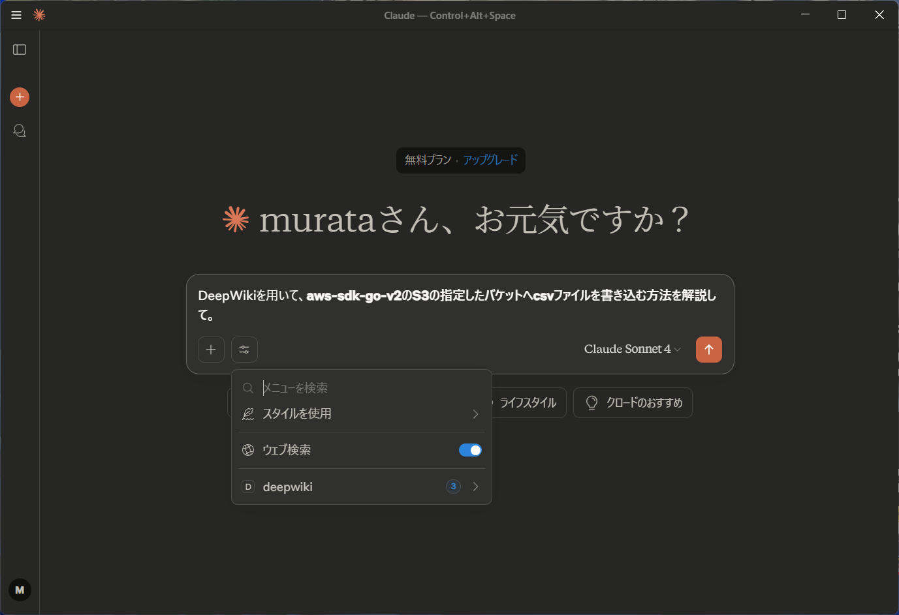
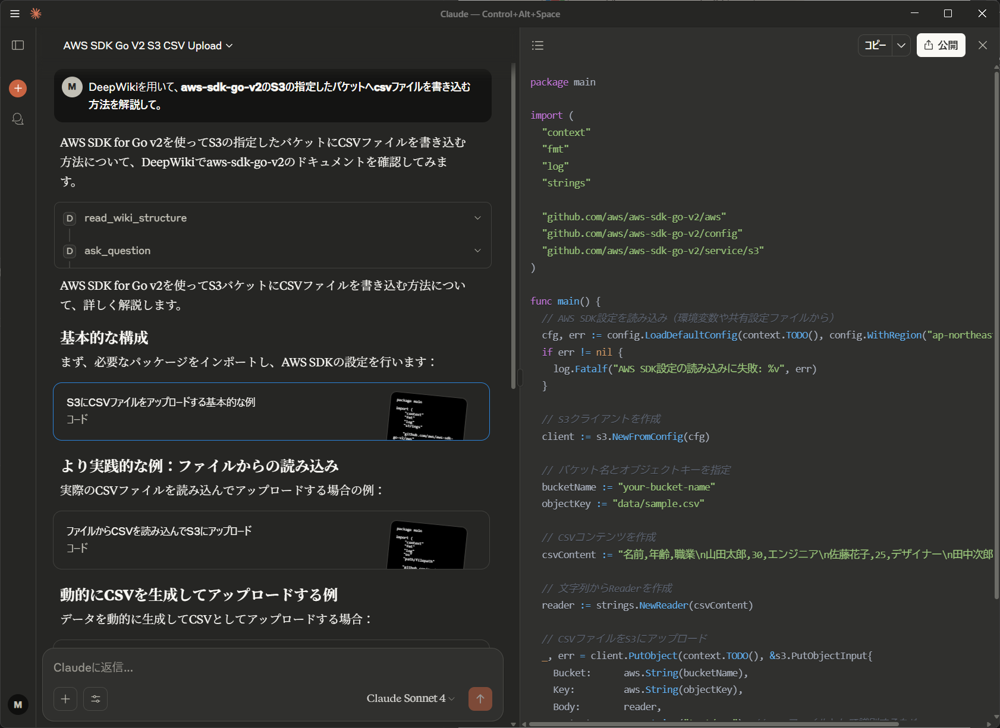

# 「Model Context Protocol (MCP)」って何？

LT 発表資料（2025）

---

# はじめに

- 「MCP」や「MCP サーバー」ってよく目にするけど何？
- AI を使って調べもの / 勉強したい（公式ドキュメントの情報を日本語で欲しい）
- 実際に使ってみた体験ベースでざっくり解説します！

---

# Model Context Protocol（MCP）とは？

> MCP は **Anthropic** が 2024 年 11 月に発表した規格。従来、AI を使ったサービス・ソフトウェア開発は、外部ツールとの連携に個別の実装が必要だったところ、**共通規格**を作ることで開発者の負担を減らすとしていた。Anthropic は **「AI アプリケーション向けの USB-C ポートのようなもの」** と例えており、すでに「Slack」「Google Drive」「GitHub」「Notion」といったツールが対応している。
> (https://www.itmedia.co.jp/aiplus/articles/2503/27/news174.html より引用)

---

# Model Context Protocol（MCP）とは？

(https://norahsakal.com/blog/mcp-vs-api-model-context-protocol-explained/ より引用)

---

# ユースケース

---

# MCP を Claude で試してみた

## AI に GitHub リポジトリの情報を参照して回答させる

- 利用するライブラリの情報を公式ドキュメントから手に入れたい

  - 日本語訳が無いものも多い（英語しんどい）
  - ほしい情報を見つけるのに時間がかかる

→ **AI にアシストしてもらおう！**
　参照元を DeepWiki に指定することで情報の正確性を担保
　（DeepWiki: GitHub リポジトリのコードを自動解析し Wiki を生成）

---

# MCP を Claude で試してみた

## 構成

1. claude
2. MCP Server
3. DeepWiki

TODO: 図を作成する

---

# 実際の一例

プロンプト: DeepWiki を用いて、aws-sdk-go-v2 の S3 の指定したバケットへ csv ファイルを書き込む方法を解説して。

---

# 実際の一例

---

# 感想・所感

- LLM と外部機能のやり取りが見れる
  - read_wiki_structure や ask_question など
- 段階的に応用例をコード付きで解説してくれる
  - これは Claude の機能？
- プロンプトを変えることでドキュメントを作成可能
  - 出力されたドキュメント（https://claude.ai/public/artifacts/71fd20ae-23c1-44e1-964e-646729977175 ）
- 他の MCP 連携も試したい

---

# まとめ

- Model Context Protocol（MCP）について調べた
- AI の回答に対する信用を増すことができた
- MCP サーバー により AI の活用幅が広がっていく

---

# ご清聴ありがとうございました！

---

# 出典・参考資料

- ITmedia AI+: [ChatGPT が“AI 界の USB-C”こと「MCP」対応へ　競合・Anthropic 発の規格が実質的な業界標準に](https://www.itmedia.co.jp/aiplus/articles/2503/27/news174.html)
- Norah Sakal: [What is Model Context Protocol (MCP)? How it simplifies AI integrations compared to APIs](https://norahsakal.com/blog/mcp-vs-api-model-context-protocol-explained/)
- YouTube: [MCP サーバーって便利なのか？色々触ってみて感じたことを解説してみた](https://www.youtube.com/watch?v=LIz-3-T5mpc)
