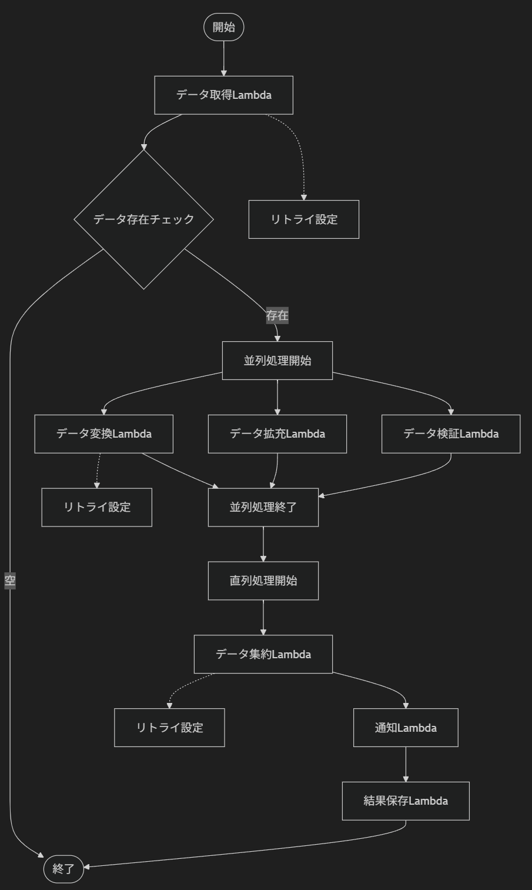

# 複雑なバッチ処理を Step Functions で分割する：設計パターンとの比較検討

## 想定読者

- AWS Lambda でバッチ処理を実装している開発者
- 単一 Lambda 関数の肥大化に課題を感じている方
- Step Functions の導入を検討している方

## 背景

複数の処理を一つの Lambda 関数で実装したバッチシステムが、保守性と可用性の課題を抱えています。本記事では、AWS Step Functions を活用してこれらの課題を解決するアプローチを検討しました。

## 現在の課題

### 1. ユースケース層の肥大化

```go
// 問題のあるコード例
func (u *BatchUsecase) ExecuteBatchProcess(ctx context.Context) error {
    // データ取得処理
    data, err := u.repo.FetchData(ctx)
    if err != nil {
        return err
    }

    // 並列処理1: データ変換
    var wg sync.WaitGroup
    transformedData := make([]ProcessedData, len(data))
    for i, item := range data {
        wg.Add(1)
        go func(idx int, d Data) {
            defer wg.Done()
            // 複雑な変換ロジック（100行以上）
            transformedData[idx] = u.transformData(d)
        }(i, item)
    }
    wg.Wait()

    // 直列処理1: バリデーション
    for _, item := range transformedData {
        if err := u.validateData(item); err != nil {
            return err
        }
    }

    // 並列処理2: 外部API呼び出し
    // ... さらに複雑な処理が続く

    return nil
}
```

### 2. テスタビリティの低下

- 深いネストによりテストケースの作成が困難
- モックの複雑化
- 部分的なテストが実行しにくい

### 3. レイヤードアーキテクチャの限界

従来の Handler → UseCase → Repository の構造では、ビジネスロジックが UseCase 層に集中し、単一責任の原則に違反してしまいます。

## 解決アプローチの比較

### プログラムレベルのアプローチ

#### 1. Command Pattern による責務分離

```go
// コマンドインターface
type BatchCommand interface {
    Execute(ctx context.Context, input interface{}) (interface{}, error)
    GetName() string
}

// データ取得コマンド
type FetchDataCommand struct {
    repo Repository
}

func (c *FetchDataCommand) Execute(ctx context.Context, input interface{}) (interface{}, error) {
    return c.repo.FetchData(ctx)
}

func (c *FetchDataCommand) GetName() string {
    return "fetch-data"
}

// データ変換コマンド
type TransformDataCommand struct {
    transformer DataTransformer
}

func (c *TransformDataCommand) Execute(ctx context.Context, input interface{}) (interface{}, error) {
    data := input.([]Data)
    return c.transformer.Transform(data)
}

// コマンド実行器
type BatchExecutor struct {
    commands []BatchCommand
}

func (e *BatchExecutor) Execute(ctx context.Context) error {
    var result interface{}
    var err error

    for _, cmd := range e.commands {
        result, err = cmd.Execute(ctx, result)
        if err != nil {
            return fmt.Errorf("command %s failed: %w", cmd.GetName(), err)
        }
    }

    return nil
}
```

#### 2. Pipeline Pattern による処理フロー管理

```go
type Stage func(ctx context.Context, input interface{}) (interface{}, error)

type Pipeline struct {
    stages []Stage
}

func (p *Pipeline) AddStage(stage Stage) *Pipeline {
    p.stages = append(p.stages, stage)
    return p
}

func (p *Pipeline) Execute(ctx context.Context, input interface{}) (interface{}, error) {
    current := input

    for i, stage := range p.stages {
        result, err := stage(ctx, current)
        if err != nil {
            return nil, fmt.Errorf("stage %d failed: %w", i, err)
        }
        current = result
    }

    return current, nil
}

// 使用例
func NewBatchPipeline(deps *Dependencies) *Pipeline {
    return &Pipeline{}.
        AddStage(deps.FetchDataStage).
        AddStage(deps.TransformDataStage).
        AddStage(deps.ValidateDataStage).
        AddStage(deps.SaveDataStage)
}
```

#### プログラムレベルアプローチの限界

- Lambda 関数の実行時間制限（15 分）
- メモリ使用量の制約
- 直列や並列の処理があると、プログラムの複雑さはあまり変わらない

### アーキテクチャレベルのアプローチ：Step Functions 活用

#### Step Functions 定義（アーキテクチャ図）



## Step Functions アプローチの課題

### 1. 結合テストレベルのテスタビリティの低下

- テスト環境の準備が必要（AWS 上にテスト環境を構築、LocalStack など）
- テスト自動化の学習コストが増加（ALS 構文チェックなど）

### 2. Lambda 分割による Step Functions の肥大化

- Step Functions -> Step Functions を呼び出すことは可能
- 処理フローが複雑化する可能性がある
- 分割のたびに StepFunctions が肥大化し、CDK などの管理が大変

### 3. Lambda 間のデータ受け渡し

- ペイロードのサイズ制限
- 受け渡しデータの整形・変換を各 Lambda で都度行うと、共通処理が重複しやすい
- セキュリティリスクの増加

## 課題解決効果の比較

現在抱えている 3 つの課題に対して、各アプローチがどの程度解決するかを評価しました：

### 1. ユースケース層の肥大化

| アプローチ           | 解決度     | 説明                                                                               |
| -------------------- | ---------- | ---------------------------------------------------------------------------------- |
| **Command Pattern**  | ⭐⭐       | 処理フローが明確化。ただし同一 Lambda 内のため、ユースケースの処理量は変わらない。 |
| **Pipeline Pattern** | ⭐⭐       | Command Pattern と同様                                                             |
| **Step Functions**   | ⭐⭐⭐⭐⭐ | 物理的分離により完全解決。各 Lambda 単一責務                                       |

### 2. テスタビリティの低下

| アプローチ           | 解決度 | 説明                                 |
| -------------------- | ------ | ------------------------------------ |
| **Command Pattern**  | ⭐     | ユースケースのテストを分割できない。 |
| **Pipeline Pattern** | ⭐     | Command Pattern と同様。             |
| **Step Functions**   | ⭐⭐⭐ | 分割したユースケース毎にテスト可能。 |

### 3. レイヤードアーキテクチャの限界

| アプローチ           | 解決度     | 説明                                               |
| -------------------- | ---------- | -------------------------------------------------- |
| **Command Pattern**  | ⭐⭐       | UseCase 層のコードの整理。根本的な責務分割はなし。 |
| **Pipeline Pattern** | ⭐⭐       | Command Pattern と同様。                           |
| **Step Functions**   | ⭐⭐⭐⭐⭐ | アーキテクチャレベルで解決。各 Lambda 独立。       |

## まとめ

複雑なバッチ処理へのアプローチとして、プログラムレベルとアーキテクチャレベルの 2 点から設計パターンを比較・検討しました。
個人的には StepFunctions による物理的な分割が現在抱えている課題を解決できそうだと感じました。（デザインパターンの効果を理解できていないため、解決策として挙げることが難しかったです。）
本記事に対して、「いやいやこのやり方が良いでしょ」的な意見を頂けたら嬉しいです。
